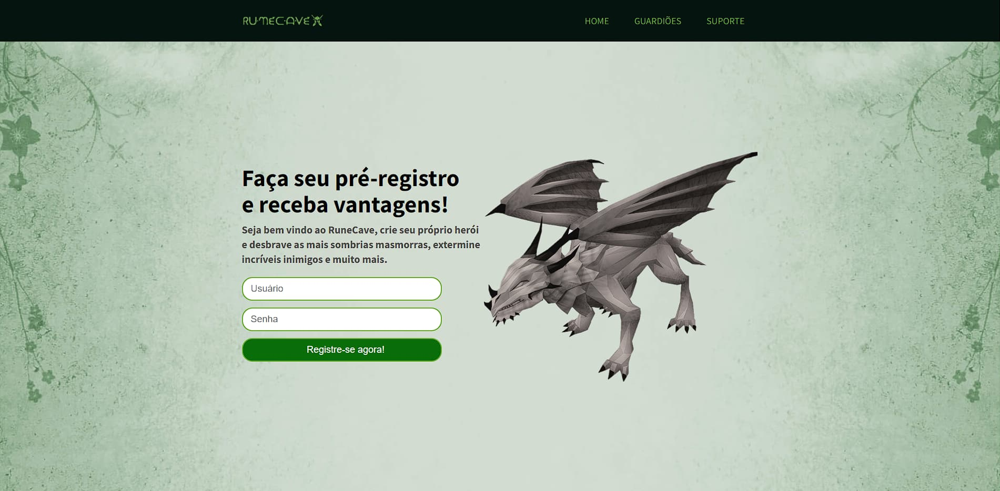

<h1 align="center"> Runecave </h1>

Runecave é um projeto pessoal realizado durante o Tech Academy da StartSe para prática de elementos no desenvolvimento web.  

  <a href="#-tecnologias">Tecnologias</a>&nbsp;&nbsp;&nbsp;|&nbsp;&nbsp;&nbsp;
  <a href="#-projeto">Projeto</a>&nbsp;&nbsp;&nbsp;|&nbsp;&nbsp;&nbsp;
  <a href="#memo-licença">Licença</a>

  

 

  

## 🚀 Tecnologias

Esse projeto foi desenvolvido com as seguintes tecnologias:

- HTML e CSS
- Git e Github

## 💻 Projeto

O Runecave é uma página de um jogo onde se encontra informações sobre personagens, realização de cadastro e suporte ao jogador.

- [Acesse o projeto, online](https://gabtech1.github.io/Projeto_StartSe/)

## :memo: Licença

Esse projeto está sob a licença MIT.

---
